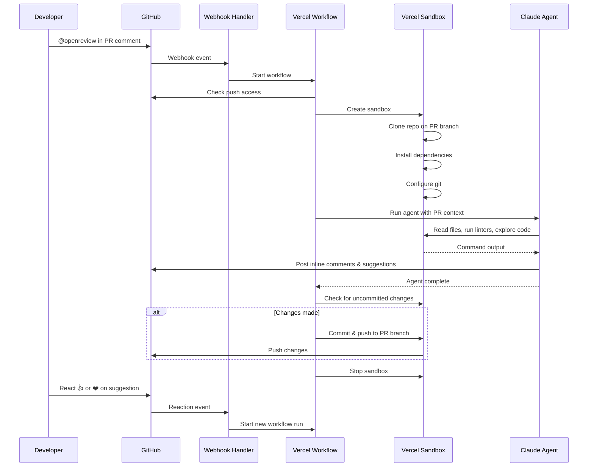

# OpenReview

An open-source, self-hosted AI code review bot. Deploy to Vercel, connect a GitHub App, and get on-demand PR reviews powered by Claude.

> **Beta**: OpenReview is currently in beta. It was built as an internal project to help the Vercel team test their technologies together. Expect rough edges and breaking changes.

[](https://vercel.com/new/clone?demo-description=An+open-source%2C+self-hosted+AI+code+review+bot.+Deploy+to+Vercel%2C+connect+a+GitHub+App%2C+and+get+automated+PR+reviews+powered+by+Claude.&demo-image=https%3A%2F%2Fopenreview.labs.vercel.dev%2Fopengraph-image.png&demo-title=openreview.labs.vercel.dev&demo-url=https%3A%2F%2Fopenreview.labs.vercel.dev%2F&from=templates&project-name=OpenReview&repository-name=openreview&repository-url=https%3A%2F%2Fgithub.com%2Fvercel-labs%2Fopenreview&env=GITHUB_APP_ID%2CGITHUB_APP_INSTALLATION_ID%2CGITHUB_APP_PRIVATE_KEY%2CGITHUB_APP_WEBHOOK_SECRET&products=%5B%7B%22integrationSlug%22%3A%22upstash%22%2C%22productSlug%22%3A%22upstash-kv%22%2C%22protocol%22%3A%22storage%22%2C%22type%22%3A%22integration%22%7D%5D&skippable-integrations=0)

## Features

- **On-demand reviews** — Mention `@openreview` or `@your-app-slug` in any PR comment to trigger a review. Powered by [Chat SDK](https://chat-sdk.dev)
- **Sandboxed execution** — Runs in an isolated [Vercel Sandbox](https://vercel.com/docs/sandbox) with full repo access, including the ability to run linters, formatters, and tests
- **Inline suggestions** — Posts line-level comments with GitHub suggestion blocks for one-click fixes
- **Code changes** — Can directly fix formatting, lint errors, and simple bugs, then commit and push to your PR branch
- **Reactions** — React with 👍 or ❤️ to approve suggestions, or 👎 or 😕 to skip
- **Durable workflows** — Built on [Vercel Workflow](https://vercel.com/docs/workflow) for reliable, resumable execution
- **Extensible skills** — Ships with built-in review [skills](https://skills.sh) and supports custom skills via `.agents/skills/`
- **Powered by Claude** — Uses Claude Sonnet 4.6 via the [AI SDK](https://sdk.vercel.ai) for high-quality code analysis
- **Simple route handler** — Easily define route handlers using [Next.js Route Handlers](https://nextjs.org/docs/app/building-your-application/routing/route-handlers) for custom API endpoints and webhooks

## How it works



1. Mention `@openreview` or `@your-app-slug` in a PR comment (optionally with specific instructions)
2. OpenReview spins up a sandboxed environment and clones the repo on the PR branch
3. A Claude-powered agent reviews the diff, explores the codebase, and runs project tooling
4. The agent posts its findings as PR comments with inline suggestions
5. If changes are made (formatting fixes, lint fixes, etc.), they're committed and pushed to the branch
6. The sandbox is cleaned up

## Prerequisites

- A [Vercel account](https://vercel.com) with billing enabled — required for [Vercel AI Gateway](https://vercel.com/docs/ai-gateway), which routes review requests to Claude Sonnet 4.6

## Setup

### 1. Deploy to Vercel

Click the button above or clone this repo and deploy it to your Vercel account.

### 2. Create a GitHub App

Create a new [GitHub App](https://github.com/settings/apps/new) with the following configuration:

**Webhook URL**: `https://your-deployment.vercel.app/api/webhooks`

**Repository permissions**:

- Contents: Read & write
- Issues: Read & write
- Pull requests: Read & write
- Metadata: Read-only

**Subscribe to events**:

- Issue comment
- Pull request review comment

Generate a private key and webhook secret, then note your App ID and Installation ID.

### 3. Configure environment variables

Add the following environment variables to your Vercel project:

| Variable                     | Description                                                            |
| ---------------------------- | ---------------------------------------------------------------------- |
| `GITHUB_APP_ID`              | The ID of your GitHub App                                              |
| `GITHUB_APP_INSTALLATION_ID` | The installation ID for your repository                                |
| `GITHUB_APP_PRIVATE_KEY`     | The private key generated for your GitHub App (with `\n` for newlines) |
| `GITHUB_APP_WEBHOOK_SECRET`  | The webhook secret you configured                                      |
| `REDIS_URL`                  | (Optional) Redis URL for persistent state, falls back to in-memory     |

### 4. Install the GitHub App

Install the GitHub App on the repositories you want OpenReview to monitor. Once installed, mention `@openreview` or `@your-app-slug` in any PR comment to trigger a review.

## Usage

**Trigger a review**: Comment `@openreview` or `@your-app-slug` on any PR. You can include specific instructions:

```
@openreview check for security vulnerabilities
@openreview run the linter and fix any issues
@openreview explain how the authentication flow works
```

**Reactions**: React with 👍 or ❤️ on an OpenReview comment to approve and apply its suggestions. React with 👎 or 😕 to skip.

## Skills

OpenReview uses a progressive skill system — the agent only loads specialized instructions when relevant, keeping context focused and reviews thorough. Skills are discovered from `.agents/skills/` at runtime.

### Built-in skills

| Skill                         | Description                                                                           |
| ----------------------------- | ------------------------------------------------------------------------------------- |
| `next-best-practices`         | File conventions, RSC boundaries, data patterns, async APIs, metadata, error handling |
| `next-cache-components`       | PPR, `use cache` directive, `cacheLife`, `cacheTag`, `updateTag`                      |
| `next-upgrade`                | Upgrade Next.js following official migration guides and codemods                      |
| `vercel-composition-patterns` | React composition patterns that scale for component refactoring                       |
| `vercel-react-best-practices` | React and Next.js performance optimization guidelines                                 |
| `vercel-react-native-skills`  | React Native and Expo best practices for performant mobile apps                       |
| `web-design-guidelines`       | Review UI code for Web Interface Guidelines and accessibility compliance              |

### Adding custom skills

Create a folder in `.agents/skills/` with a `SKILL.md` file containing YAML frontmatter:

```
.agents/skills/
└── my-custom-skill/
    └── SKILL.md
```

```markdown
---
name: my-custom-skill
description: When to use this skill — the agent reads this to decide whether to load it.
---

# My Custom Skill

Your specialized review instructions here...
```

The agent sees only skill names and descriptions in its system prompt. When a request matches a skill, it calls `loadSkill` to get the full instructions — keeping the context window clean.

## Tech stack

- [Next.js](https://nextjs.org) — App framework
- [Vercel Workflow](https://vercel.com/docs/workflow) — Durable execution
- [Vercel Sandbox](https://vercel.com/docs/sandbox) — Isolated code execution
- [AI SDK](https://sdk.vercel.ai) — AI model integration
- [Chat SDK](https://www.npmjs.com/package/chat) — GitHub webhook handling
- [Octokit](https://github.com/octokit/octokit.js) — GitHub API client

## Development

```bash
bun install
bun dev
```

## License

MIT
